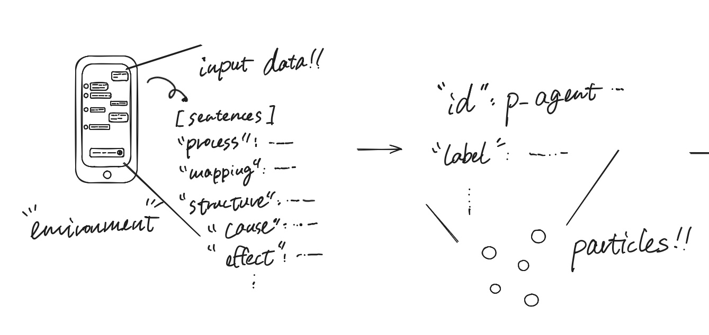

# Micro—ACT-R (tentative)
# "ACT-R at a Micro-Scale"
## What makes this different from standard ACT-R?

Standard ACT-R operates on a macro level with production rules. This project zooms into the micro-level of cognitive processing.


# Current Phase:Particle Encapsulation
**Deterministic engine that encapsulates structured context logs into algebraic particle objects.⁠**




## Stage 1 of the Cognitive OS Pipeline  
 Converts structured context logs [`log.json`](https://github.com/ao-labs-123/particle-encapsulation/blob/main/log.json) into algebraic particle objects [`particle.json`](https://github.com/ao-labs-123/particle-encapsulation/blob/main/particles.json) deterministically.

---

## Overview

This repository implements the **Particle Encapsulation** stage for the rule-based Cognitive OS. 
Instead of relying on probabilistic LLM approximations, this module ingests the logical analysis logs generated from natural language inputs and packages them into discrete, structured **`Particle`** objects.

### Pipeline Position

```text
[ log.json ] ──> [ Particle Encapsulation ] ──> [ particle.json ] ──> (Topological Mapping)
```


## Core Data Model (⁠Particle⁠)
Each encapsulated concept or relation is structured as a **`Particle⁠`** dataclass with the following attributes:


- **id:** Unique identifier (e.g., `p_agent_f06dbc`)
- **label:** Extracted text content (e.g., `"I"`, `"you helped"`, `"i succeeded"`)
- **type:** Entity classification (`Agent`, `Cause`, `Effect`, etc.)
- **state:** Deterministic resolution state (`determined` / `unspecified`)
- **constraints:** Logical rules applied during extraction
- **properties:** Contextual properties and metadata


## Quick Start

**1. Prerequisites**

- Python 3.10+

**2. Execution**

Run the main script to ingest ⁠**`log.json⁠`** and generate **⁠`particle.json⁠`**:
```
 python main.py

```

**3. Output**

The engine will parse the input log and export the encapsulated particle cloud into ⁠particle.json⁠.

```particle.json
[
  {
    "id": "p_agent_f06dbc",
    "label": "I",
    "entity_type": "Agent",
    "state": "determined"
  },
  {
    "id": "p_cause_9c0b4a",
    "label": "you helped",
    "entity_type": "Cause",
    "state": "determined"
  }
]

```

## Repository Structure

```repository

particle-encapsulation/
├── README.md               # Project documentation
├── log.json                # Ingested context log
├── particle.json           # Exported particle cloud output
├── main.py                 # Execution script
└── src/
    ├── particle.py         # Particle data class definition
    └── factory.py          # ParticleFactory parser and transformation logic

```